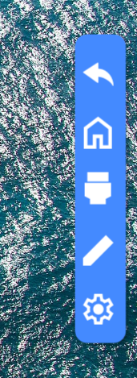
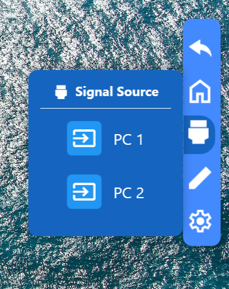
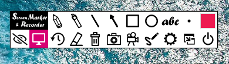

# Floating Menu Application

[](https://dotnet.microsoft.com/)
[](https://docs.microsoft.com/en-us/dotnet/csharp/)
[](https://docs.microsoft.com/en-us/dotnet/desktop/wpf/)
[](../../Apache-2.0.txt)

A Windows WPF application that provides an edge-docked floating menu interface for camera switching, signal source management, and ppInk screen annotation integration on interactive flat panel displays (IFPD).

## 📋 Table of Contents

- [Overview](#overview)
- [Features](#features)
- [System Requirements](#system-requirements)
- [Quick Start](#quick-start)
- [Architecture](#architecture)
- [Configuration](#configuration)
- [User Interface](#user-interface)
- [Camera Management](#camera-management)
- [Signal Source Detection](#signal-source-detection)
- [Screen Annotation Integration](#screen-annotation-integration)
- [TouchBack Integration](#touchback-integration)
- [Troubleshooting](#troubleshooting)
- [Contributing](#contributing)
- [License](#license)

## 🔍 Overview

The Floating Menu application provides a convenient edge-docked interface for managing camera feeds and signal sources on Windows-based interactive displays. It features a collapsible menu system, real-time camera preview, automatic camera detection via Windows PnP utilities, and integration with ppInk screen annotation tool (automatically downloaded during build).

### Architecture

```
┌─────────────────────────────────────────────────────────────────┐
│                    Floating Menu Application                    │
├─────────────────────────────────────────────────────────────────┤
│  Edge Handle  →  Menu Control  →  Signal Source Manager         │
│      ↓               ↓                    ↓                     │
│  Draggable    Menu Items      Camera Detection (pnputil)        │
│  Collapse     - Home          Camera List (ObservableCollection)│
│  Expand       - Exit                      ↓                     │
│  Always-On    - Signal Source  →  Camera Window                 │
│               - Annotation             (AForge.NET)             │
│               - Settings                  ↓                     │
│                                    Full Screen Display          │
├─────────────────────────────────────────────────────────────────┤
│  External Integration: ppInk Annotation Tool (auto-downloaded)  │
└─────────────────────────────────────────────────────────────────┘
```

### Project Structure
```
Windows/
├── FloatingMenu/ 
│   ├── MainWindow.xaml(.cs)              # Main application window and logic 
│   ├── App.xaml(.cs)                     # Application startup and configuration 
│   ├── AssemblyInfo.cs                   # Assembly metadata and configuration
│   ├── FloatingMenu.csproj               # Project file with build targets
│   ├── config.json                       # Application configuration
│   ├── Controls/ 
│   │   ├── EdgeHandleControl.xaml(.cs)   # Collapsible edge handle 
│   │   ├── EdgeMenuControl.xaml(.cs)     # Main menu interface 
│   │   ├── SignalSource.xaml(.cs)        # Camera/signal source management 
│   │   └── CameraWindow.xaml(.cs)        # Full-screen camera display 
│   ├── Helpers/ 
│   │   ├── SignalSourceModel.cs          # Camera/signal source data model 
│   │   └── DeviceStatusEnum.cs           # Device connection status enum 
│   ├── Styles/ 
│   │   ├── ButtonDictionary.xaml         # Custom button styles 
│   │   └── ListDictionary.xaml           # Custom list styles 
│   └── bin/ 
│       └── Release/ 
│           └── net10.0-windows/ 
│               ├── FloatingMenu.exe      # Published executable
│               ├── ppInk_Extracted/      # ppInk annotation tool (auto-downloaded)
│               │   └── ppInk/
│               │       └── ppInk.exe
│               └── ExternalTools/        # External services (auto-copied)
│                   └── TouchDataCaptureService/
│                        └──TouchDataCaptureService.exe
├── GetTouchInfo/
│   ├── TouchDataCaptureService.csproj    # Touch data capture service project
│   └── Program.cs                        # Touch data capture implementation
└── ExternalTools/
    └── TouchDataCaptureService/          # Staging area for build process
         └── TouchDataCaptureService.exe
```

## ✨ Features

### Core Functionality
- **Edge-Docked Interface** - Always-accessible menu docked to the right edge of the screen
- **Collapsible Design** - Expands/collapses with smooth animations
- **Draggable Handle** - Vertically repositionable while staying docked to the edge
- **Auto-Docking** - Automatically returns to right edge when moved

### Camera Management
- **Automatic Camera Detection** - Enumerates connected cameras using Windows PnP utilities (`pnputil`)
- **Real-Time Preview** - Full-screen camera feed using AForge.NET framework
- **Multi-Camera Support** - Switch between multiple connected cameras via DirectShow
- **Optimized Resolution** - Automatically selects highest available camera resolution
- **Frame Rate Optimization** - Adaptive frame display with frame skipping (30 FPS effective)
- **Async Camera Loading** - Non-blocking camera enumeration for smooth UI experience
- **Automatic Cleanup** - Camera resources released on window close

### Signal Source Management
- **Device Status Tracking** - Shows Available, Connected, or Disconnected states
- **Observable Collection** - Real-time UI updates when devices change
- **Single Connection Mode** - Only one camera can be active at a time
- **Visual Status Indicators** - Color-coded status for each signal source
- **Device Indexing** - Cameras automatically indexed (PC 1, PC 2, etc.)
- **Event-Driven Architecture** - Uses `DeviceSelected` and `CameraClosed` events for state management

### Screen Annotation Integration
- **Automatic ppInk Integration** - ppInk downloaded during build, no manual installation
- **External App Launch** - Integrates with ppInk annotation tool
- **Process Monitoring** - Detects when ppInk closes
- **Seamless Workflow** - Menu auto-collapses when launching annotation
- **Bundled Deployment** - ppInk included with application package

### User Interface
- **Responsive Sizing** - Adapts to screen dimensions dynamically
- **Smooth Animations** - Polished expand/collapse transitions
- **Flyout Panels** - Slide-out configuration panels
- **Custom Styling** - Branded button and list styles
- **Menu Items**:
  - Home (Collapse menu)
  - Exit (Close application)
  - Signal Source (Camera selection)
  - Annotation (Toggle ppInk annotation tool - click once to open, click again to close)
  - Settings (Future expansion)

## 💻 System Requirements

### Hardware
- **Operating System**: Windows 11
- **Display**: Interactive flat panel display or standard monitor
- **Camera**: USB camera(s) compatible with DirectShow (DSHOW)
- **RAM**: Minimum 4 GB (8 GB recommended for HD camera feeds)
- **Disk Space**: 200 MB (for application, dependencies, and ppInk)

### Software
- **.NET Runtime**: .NET 10 Runtime or SDK
- **Camera Drivers**: DirectShow-compatible camera drivers
- **ppInk**: Automatically included (no separate installation needed)

### Dependencies
- **AForge.Video**: Video processing framework for camera capture
- **AForge.Video.DirectShow**: DirectShow wrapper for video input devices
- **System.Drawing.Common**: Bitmap processing and GDI+ interop

### Permissions
- **Standard User** - No administrator rights required for normal operation
- **Camera Access** - Windows Camera privacy settings must allow desktop apps
- **PnP Enumeration** - Access to Windows Plug and Play device enumeration

## 🚀 Quick Start

### Installation

1. **Install .NET 10 Runtime**
   - Download from: https://dotnet.microsoft.com/download/dotnet/10.0
   - Or use winget:
     ```powershell
     winget install Microsoft.DotNet.Runtime.10
     ```

2. **Download or Build the Application**
   - Clone repository:
     ```powershell
     git clone https://github.com/intel-sandbox/ifpd-touchback-floatingmenu.git
     cd ifpd-touchback-floatingmenu\Windows\FloatingMenu
     ```
   - Build Release version:
     ```powershell
     dotnet build -c Release
     ```

3. **Run the Application**
   - Navigate to build output:
     ```powershell
     cd bin\Release\net10.0-windows
     ```
   - Launch application:
     ```powershell
     .\FloatingMenu.exe
     ```

### First Run

1. **Application starts** with a thin edge handle on the right side of the screen
2. **Click the edge handle** to expand the menu
3. **Select "Signal Source"** to view available cameras (automatically detected)
4. **Click a camera** from the list to open full-screen preview
5. **Drag the edge handle** vertically to reposition as needed
6. **Click the connected camera** again to disconnect and close the preview

## ⚙️ Configuration

### Default Settings

- **Window Position**: Right edge of screen, vertically centered
- **Collapsed Size**: 3.5% screen width × 25% screen height
- **Expanded Size**: 18% screen width × 45% screen height
- **Effective Frame Rate**: ~30 FPS (frame skipping every other frame)
- **Camera Resolution**: Highest available resolution from camera capabilities
- **Video Capture API**: DirectShow (DSHOW) via AForge.NET
- **Camera Naming**: Automatic sequential naming (PC 1, PC 2, etc.)

### Customization

#### Window Dimensions

To modify window dimensions, edit `MainWindow.xaml.cs`:
```csharp
// Collapsed state
this.Width = screenWidth * 0.035;  // 3.5% of screen width
this.Height = screenHeight * 0.25;  // 25% of screen height

// Expanded state
this.Width = screenWidth * 0.18;   // 18% of screen width
this.Height = screenHeight * 0.45; // 45% of screen height
```

#### Camera Resolution

To adjust camera resolution selection, edit `CameraWindow.xaml.cs`:
```csharp
// Current: Selects highest resolution automatically
VideoCapabilities best = _videoSource.VideoCapabilities
    .OrderByDescending(c => c.FrameSize.Width * c.FrameSize.Height)
    .First();

_videoSource.VideoResolution = best;

// Alternative: Manually select specific resolution
// _videoSource.VideoResolution = _videoSource.VideoCapabilities
//     .First(c => c.FrameSize.Width == 1920 && c.FrameSize.Height == 1080);
```

#### Frame Rate

To adjust frame display rate, edit `CameraWindow.xaml.cs`:
```csharp
// Current: Displays every other frame (~30 FPS effective)
if (++_frameCounter % 2 != 0)
    return;

// For full frame rate, remove frame skipping:
// if (++_frameCounter % 1 != 0)  // Shows all frames
//     return;

// For lower frame rate:
// if (++_frameCounter % 3 != 0)  // Shows every 3rd frame (~20 FPS)
//     return;
```

### ppInk Annotation Tool Path

The ppInk path is automatically configured using relative pathing:
```csharp
string exePath = System.IO.Path.Combine(
    AppDomain.CurrentDomain.BaseDirectory,
    "ppInk_Extracted",
    "ppInk",
    "ppInk.exe");
```

**No manual configuration needed!** ppInk is automatically downloaded during the build process and bundled with the application.

## 🖥️ User Interface

### Edge Handle (Collapsed State)

<table>
<tr>
<td width="70%">

- **Size**: Thin vertical bar (3.5% × 25% of screen)
- **Position**: Right edge, vertically draggable
- **Interaction**: Click to expand, drag to reposition vertically
- **Behavior**: Auto-docks to right edge when moved

</td>
<td width="30%" align="center">


</td>
</tr>
</table>

### Menu (Expanded State)

<table>
<tr>
<td width="70%">

- **Size**: Larger panel (18% × 45% of screen)
- **Menu Items**:
1. **Home** - Collapse menu
2. **Exit** - Close application
3. **Signal Source** - Manage cameras
4. **Annotation** - Toggle ppInk annotation tool (open/close)
5. **Settings** - Reserved for future use

</td>
<td width="30%" align="center">



</td>
</tr>
</table>

### Signal Source Flyout

<table>
<tr>
<td width="70%">

- **Camera List**: Shows all detected cameras (PC 1, PC 2, etc.)
- **Status Indicators**:
  - **Green**: Available
  - **Blue**: Connected
  - **Gray**: Disconnected
- **Selection**: Click to connect/disconnect camera
- **Behavior**: Only one camera can be active at a time
- **Auto-Detection**: Cameras loaded asynchronously on page initialization

</td>
<td width="30%" align="center">



</td>
</tr>
</table>

### Camera Window

- **Display**: Full-screen borderless window
- **Resolution**: Highest available from camera capabilities
- **Effective Frame Rate**: ~30 FPS (with frame skipping optimization)
- **Controls**: Close window to disconnect camera
- **Auto-Return**: Menu reopens with Signal Source flyout when camera closes via `CameraClosed` event

## 📹 Camera Management

### Automatic Detection

The application uses Windows `pnputil` command to enumerate connected cameras asynchronously:
```csharp
var process = new Process();
process.StartInfo.FileName = "cmd.exe";
process.StartInfo.Arguments = "/c pnputil /enum-devices /class Camera /connected";
process.StartInfo.RedirectStandardOutput = true;
process.StartInfo.UseShellExecute = false;
process.StartInfo.CreateNoWindow = true;

process.Start();
string output = await process.StandardOutput.ReadToEndAsync();
process.WaitForExit();
```

### Camera Initialization

The application uses **AForge.NET** framework for DirectShow camera access:
```csharp
// Enumerate DirectShow video devices
_videoDevices = new FilterInfoCollection(FilterCategory.VideoInputDevice);

// Select camera by index
_videoSource = new VideoCaptureDevice(_videoDevices[cameraIndex].MonikerString);

// Get highest resolution capability
VideoCapabilities best = _videoSource.VideoCapabilities
    .OrderByDescending(c => c.FrameSize.Width * c.FrameSize.Height)
    .First();

// Set video resolution
_videoSource.VideoResolution = best;

// Register frame event handler
_videoSource.NewFrame += VideoSource_NewFrame;

// Start camera capture
_videoSource.Start();
```

### Frame Processing

Each new frame is processed and displayed:
```csharp
private void VideoSource_NewFrame(object sender, NewFrameEventArgs eventArgs)
{
    try
    {
        // Frame skipping for performance (display every other frame)
        if (++_frameCounter % 2 != 0)
            return;

        using (Bitmap bitmap = (Bitmap)eventArgs.Frame.Clone())
        {
            IntPtr hBitmap = bitmap.GetHbitmap();

            Dispatcher.BeginInvoke(new Action(() =>
            {
                try
                {
                    var source = Imaging.CreateBitmapSourceFromHBitmap(
                        hBitmap,
                        IntPtr.Zero,
                        Int32Rect.Empty,
                        BitmapSizeOptions.FromEmptyOptions());

                    CameraImage.Source = source;
                }
                finally
                {
                    DeleteObject(hBitmap); // Release GDI+ resource
                }
            }));
        }
    }
    catch
    {
        // Silently handle frame processing errors
    }
}
```

### Connection Workflow

1. **Page loads** and calls `LoadCameras()` asynchronously
2. **Application queries** connected cameras via PnP utility
3. **Devices populate** in observable collection with automatic indexing
4. **User selects** a camera from the list via mouse click
5. **Device status toggles** to Connected (all others set to Available)
6. **`DeviceSelected` event fires** with camera index
7. **Camera window opens** in full-screen mode
8. **AForge.NET** enumerates DirectShow devices and initializes selected camera
9. **Highest resolution** is automatically selected from camera capabilities
10. **Frame capture starts** with `NewFrame` event handler
11. **Frames display** at ~30 FPS effective rate (every other frame)

### Camera Disconnection

- **Close camera window** - Window `Closed` event triggers cleanup and `CameraClosed` event
- **Toggle in Signal Source list** - Click connected camera to disconnect (fires `DeviceSelected(-1)`)
- **Select "Exit"** from menu while camera is active
- **Exception handling** - Errors during camera start trigger automatic cleanup and close

### Camera Cleanup

The application properly manages camera resources:
```csharp
private void StopCamera()
{
    try
    {
        if (_videoSource != null)
        {
            _videoSource.SignalToStop();  // Signal camera to stop
            _videoSource.WaitForStop();   // Wait for camera thread to terminate
            _videoSource = null;
        }
    }
    catch 
    { 
        // Ignore cleanup errors
    }
}
```

### Error Handling

When camera initialization fails (e.g., PC Cast not enabled):
```csharp
catch(Exception e)
{
    MessageBox.Show("PC Cast is not Enabled for the selected device.");
    StopCamera();

    Dispatcher.BeginInvoke(() =>
    {
        CameraClosed?.Invoke();
        this.Close();
    });
}
```

### Supported Camera Types

- **USB webcams** (UVC-compatible)
- **Integrated laptop cameras**
- **Document cameras**
- **Any DirectShow-compatible video capture device**
- **PC Cast enabled devices** (required for some hardware)

## 🔍 Signal Source Detection

### Detection Process
```
    var process = new Process();
    process.StartInfo.FileName = "cmd.exe";
    process.StartInfo.Arguments = "/c pnputil /enum-devices /class Camera /connected";
    process.StartInfo.RedirectStandardOutput = true;
    process.StartInfo.UseShellExecute = false;
    process.StartInfo.CreateNoWindow = true;

    process.Start();

    string output = await process.StandardOutput.ReadToEndAsync();
```

### Parsing Camera Information

The application extracts camera names from:
- **Device Description** fields in pnputil output
- **Friendly Name** fields in pnputil output
- Both are checked using case-insensitive comparison

### Status Management

- **Available** (default): Camera detected and ready for connection
- **Connected**: Camera actively streaming (only one device at a time)
- **Disconnected**: Camera removed or unavailable (future use)

## 🎨 Screen Annotation Integration

### ppInk Annotation Tool (Automatic Integration)

<div>
    
</div>

- **ppInk** - Open-source screen annotation tool
- Version: 1.9.0 RC1
- Platform: Windows x64
- **Automatically downloaded during build** - No manual installation required!
- Repository: [https://github.com/pubpub-zz/ppInk](https://github.com/pubpub-zz/ppInk)

### Integration Features

- **Automatic Download**: ppInk downloaded during build process via MSBuild target
- **Bundled Deployment**: ppInk included with application (no separate installation)
- **Toggle Control**: Click once to open ppInk, click again to close it
- **Process Management**: Starts and stops ppInk annotation application on demand
- **Process Monitoring**: Tracks ppInk process state and detects when user closes it
- **UI Coordination**: Menu auto-collapses when launching ppInk
- **Menu State**: Clears selection when ppInk closes
- **Relative Pathing**: Automatically locates ppInk relative to application directory

### Workflow

**Opening ppInk:**
1. User clicks **Annotation** menu item (first click)
2. Application launches **ppInk.exe** from bundled location
3. Menu **auto-collapses** to minimize interference
4. User annotates screen using ppInk

**Closing ppInk:**
5. User closes ppInk via:
   - **Annotation menu item** (click again) - Application terminates ppInk process
   - **ESC key** or ppInk toolbar exit - User closes ppInk directly
6. Application **detects exit** and clears menu selection

### ppInk Path Configuration

The application automatically locates ppInk using a relative path:
```csharp
string exePath = System.IO.Path.Combine(
    AppDomain.CurrentDomain.BaseDirectory,
    "ppInk_Extracted",
    "ppInk",
    "ppInk.exe");
```

### Using Alternative Annotation Tools

To integrate a different annotation tool instead of ppInk:

1. Modify the `exePath` in `LaunchAnnotationAppAsync` method in `MainWindow.xaml.cs`:
   ```csharp
   string exePath = @"C:\Path\To\Your\AnnotationTool.exe";
   ```

2. (Optional) Remove or modify the ppInk download MSBuild target in `FloatingMenu.csproj`:
   ```xml
   <Target Name="DownloadAndExtract_ppInk" AfterTargets="Build">
   ```

3. Rebuild the application

## 🔌 TouchBack Integration

The Floating Menu application integrates with the **TouchDataCaptureService** executable to capture and process touch data from interactive display devices. This service runs as a separate process and communicates with the hardware via a configured COM port.

### Overview

The TouchBack functionality enables:
- **Touch Data Capture** - Captures raw touch input from IFPD devices
- **Process Management** - Automatically starts/stops the service with camera selection
- **COM Port Communication** - Configurable serial port communication with touch hardware
- **Automated Build** - Service executable is automatically built and deployed with the main application

### Build Process

#### Automatic Publishing

The TouchDataCaptureService executable is automatically published during the FloatingMenu build process through custom MSBuild targets defined in `FloatingMenu.csproj`:

```xml
<Target Name="PublishAndCopyGetTouchInfo" AfterTargets="Build">
    <!-- Publish TouchDataCaptureService as self-contained single-file executable -->
    <Exec Command="dotnet publish &quot;$(MSBuildThisFileDirectory)..\GetTouchInfo\TouchDataCaptureService.csproj&quot; 
                   -c Release 
                   -r win-x64 
                   --self-contained true 
                   -p:PublishSingleFile=true 
                   -p:IncludeNativeLibrariesForSelfExtract=true 
                   -o &quot;$(MSBuildThisFileDirectory)..\GetTouchInfo\bin\Release\Publish&quot;" />

    <!-- Create ExternalTools directory -->
    <MakeDir Directories="$(MSBuildThisFileDirectory)..\ExternalTools\TouchDataCaptureService" />

    <!-- Copy executable to ExternalTools -->
    <Copy SourceFiles="$(MSBuildThisFileDirectory)..\GetTouchInfo\bin\Release\Publish\TouchDataCaptureService.exe"
          DestinationFolder="$(MSBuildThisFileDirectory)..\ExternalTools\TouchDataCaptureService"
          SkipUnchangedFiles="true" />
</Target>
```

#### Build Output Structure

After building, the structure is:
```
Windows/
├── FloatingMenu/
│   └── bin/
│       └── Release/
│           └── net10.0-windows/
│               ├── FloatingMenu.exe
│               └── ExternalTools/
│                   └── TouchDataCaptureService/
│                       └── TouchDataCaptureService.exe
└── GetTouchInfo/
    └── bin/
        └── Release/
            └── Publish/
                └── TouchDataCaptureService.exe
```

#### Deploy to Output Directory

Two additional targets ensure the ExternalTools folder is copied to the output:

```xml
<!-- Copy during Build -->
<Target Name="CopyExternalTools_Build" AfterTargets="Build">
    <ItemGroup>
        <ExternalFiles Include="$(ProjectDir)..\ExternalTools\**\*" />
    </ItemGroup>
    <Copy SourceFiles="@(ExternalFiles)" 
          DestinationFolder="$(OutDir)ExternalTools\%(RecursiveDir)" />
</Target>

<!-- Copy during Publish -->
<Target Name="CopyExternalTools_Publish" AfterTargets="Publish">
    <ItemGroup>
        <ExternalFiles Include="$(ProjectDir)..\ExternalTools\**\*" />
    </ItemGroup>
    <Copy SourceFiles="@(ExternalFiles)" 
          DestinationFolder="$(PublishDir)ExternalTools\%(RecursiveDir)" />
</Target>
```

### Process Lifecycle Management

#### Starting the TouchBack Service

When a signal source (camera) is selected, the TouchDataCaptureService is launched automatically:

```csharp
// In MainWindow.xaml.cs - DeviceSelected event handler
private void SignalSourcePage_DeviceSelected(int cameraIndex)
{
    if (cameraIndex >= 0)
    {
        // Start TouchDataCaptureService process
        StartTouchDataCaptureService();

        // Open camera window
        cameraWindow = new CameraWindow(cameraIndex);
        cameraWindow.CameraClosed += CameraWindow_CameraClosed;
        cameraWindow.Show();
    }
    else
    {
        // Stop TouchDataCaptureService process
        StopTouchDataCaptureService();

        // Close camera
        cameraWindow?.Close();
    }
}
```

#### Process Management Implementation

```csharp
private Process _touchDataCaptureProcess;

private void StartTouchDataCaptureService()
{
    try
    {
        // Path to the TouchDataCaptureService executable
        string exePath = Path.Combine(
            AppDomain.CurrentDomain.BaseDirectory, 
            "ExternalTools", 
            "TouchDataCaptureService", 
            "TouchDataCaptureService.exe"
        );

        if (!File.Exists(exePath))
        {
            MessageBox.Show($"TouchDataCaptureService not found at: {exePath}");
            return;
        }

        // Start the process
        _touchDataCaptureProcess = new Process();
        _touchDataCaptureProcess.StartInfo.FileName = exePath;
        _touchDataCaptureProcess.StartInfo.UseShellExecute = false;
        _touchDataCaptureProcess.StartInfo.CreateNoWindow = true;
        _touchDataCaptureProcess.Start();
    }
    catch (Exception ex)
    {
        MessageBox.Show($"Failed to start TouchDataCaptureService: {ex.Message}");
    }
}

private void StopTouchDataCaptureService()
{
    try
    {
        if (_touchDataCaptureProcess != null && !_touchDataCaptureProcess.HasExited)
        {
            _touchDataCaptureProcess.Kill();
            _touchDataCaptureProcess.WaitForExit(1000);
            _touchDataCaptureProcess.Dispose();
            _touchDataCaptureProcess = null;
        }
    }
    catch (Exception ex)
    {
        // Silently handle cleanup errors
    }
}
```

#### Stopping the TouchBack Service

The service is automatically stopped when:
- User disconnects the camera (toggles signal source to Available)
- User closes the camera window
- Application exits
- `DeviceSelected` event fires with index `-1`

### Configuration

#### Finding the Correct COM Port

1. **Device Manager Method**
   ```
   Device Manager → Ports (COM & LPT) → Look for your touch device
   ```

2. **PowerShell Method**
   ```powershell
   Get-WmiObject Win32_SerialPort | Select-Object Name, DeviceID
   ```

3. **Windows Settings**
   ```
   Settings → Bluetooth & devices → Devices → More devices and printer settings
   ```

#### Updating Configuration

To change the COM port:

1. **Locate config.json**
   ```
   FloatingMenu.exe directory → ExternalTools → TouchDataCaptureService → config.json
   ```

2. **Edit the file** using any text editor:
   ```json
   {
     "ComPort": "COM5",  // Change to your COM port
     "BaudRate": 115200
   }
   ```

3. **Restart the application** for changes to take effect

#### Configuration Validation

The TouchDataCaptureService validates the configuration on startup:
- Checks if the specified COM port exists
- Verifies port is not already in use
- Logs configuration errors to the log file (if logging enabled)

### Workflow Integration

#### Complete Signal Source Selection Flow

1. **User selects camera** from Signal Source list
2. **FloatingMenu fires `DeviceSelected` event** with camera index
3. **TouchDataCaptureService.exe launches** as background process
   - Reads `config.json` for COM port settings
   - Opens serial port connection
   - Begins capturing touch data
4. **Camera window opens** in full-screen mode
5. **Touch data is captured** while camera is active

#### Complete Signal Source Deselection Flow

1. **User clicks connected camera** or closes camera window
2. **FloatingMenu fires `DeviceSelected` event** with index `-1`
3. **TouchDataCaptureService process is terminated**
   - Serial port connection closed gracefully
   - Resources released
4. **Camera window closes**
5. **Menu returns** to Signal Source selection state

### Troubleshooting TouchBack Integration

#### Service Not Starting

**Problem:** TouchDataCaptureService doesn't start when camera is selected

**Solutions:**

1. **Verify executable exists**
   ```powershell
   Test-Path "ExternalTools\TouchDataCaptureService\TouchDataCaptureService.exe"
   ```

2. **Check build output**
   - Build FloatingMenu project
   - Look for "Published TouchDataCaptureService.exe" message in build output

3. **Manually rebuild service**
   ```powershell
   dotnet publish ..\GetTouchInfo\TouchDataCaptureService.csproj -c Release -r win-x64 --self-contained
   ```

4. **Check for antivirus blocking**
   - Some antivirus software may block unsigned executables
   - Add exception for TouchDataCaptureService.exe

#### COM Port Errors

**Problem:** Service starts but can't connect to COM port

**Solutions:**

1. **Verify COM port exists**
   ```powershell
   [System.IO.Ports.SerialPort]::GetPortNames()
   ```

2. **Check port not in use**
   - Close other applications using the port
   - Check Task Manager for lingering processes

3. **Update config.json**
   ```json
   {
     "ComPort": "COM3",  // Verify this matches Device Manager
     "BaudRate": 115200
   }
   ```

4. **Check permissions**
   - Ensure user has access to serial ports
   - May require administrator rights on some systems

5. **Verify hardware connection**
   - Check USB cable for touch device
   - Ensure device drivers are installed

#### Process Not Terminating

**Problem:** TouchDataCaptureService continues running after camera closes

**Solutions:**

1. **Manually kill process**
   ```powershell
   Get-Process TouchDataCaptureService | Stop-Process -Force
   ```

2. **Check Task Manager**
   - Look for orphaned TouchDataCaptureService.exe processes
   - End task manually

3. **Restart FloatingMenu**
   - Close application completely
   - Relaunch to reset process management

#### Configuration Not Loading

**Problem:** Changes to config.json don't take effect

**Solutions:**

1. **Verify JSON syntax**
   - Use online JSON validator
   - Check for missing commas or quotes

2. **Check file location**
   ```
   ExternalTools/TouchDataCaptureService/config.json
   ```
   - Must be in same directory as .exe

3. **Verify file encoding**
   - Save as UTF-8 without BOM
   - Use Notepad++ or VS Code

4. **Restart service**
   - Disconnect and reconnect camera
   - Configuration loaded on process start

#### No Touch Data Captured

**Problem:** Service runs but no touch data is captured

**Solutions:**

1. **Check log file**

2. **Enable logging in config.json**
   ```json
   {
     "EnableLogging": true,
     "LogFilePath": "TouchDataLog.txt"
   }
   ```

3. **Verify hardware communication**
   - Test COM port with serial terminal (PuTTY, etc.)
   - Confirm device is sending data

4. **Check baud rate**
   - Verify matches hardware specifications
   - Common values: 9600, 19200, 38400, 115200

## 🔧 Troubleshooting

### 1. No Cameras Detected

**Problem:** Signal Source list is empty or doesn't populate

**Solutions:**

1. **Verify camera connection**
   - Check USB cable
   - Try different USB port
   - Restart camera if external

2. **Check Windows Camera permissions**
   - Settings → Privacy → Camera
   - Enable "Allow desktop apps to access your camera"

3. **Verify camera in Device Manager**
   - Device Manager → Cameras or Imaging devices
   - Ensure no yellow warning icons

4. **Test with PowerShell**
   ```powershell
   pnputil /enum-devices /class Camera /connected
   ```

5. **Check pnputil output manually**
   - Look for "Device Description:" or "Friendly Name:" fields
   - Ensure camera appears in the output

6. **Update camera drivers**
   - Device Manager → Right-click camera → Update driver

7. **Test camera with Camera app**
   ```powershell
   start microsoft.windows.camera:
   ```

8. **Restart the application**
   - Close and reopen FloatingMenu to trigger re-enumeration

### 2. Camera Window Shows Black Screen

**Problem:** Camera window opens but displays black/frozen image

**Solutions:**

1. **Check camera is not in use by another application**
   - Close Zoom, Teams, Skype, etc.
   - Check for other camera apps in Task Manager

2. **Verify DirectShow support**
   - Some cameras may not support DirectShow API
   - Try with different camera

3. **Check camera index**
   - Ensure the correct camera index is being used
   - Try different cameras from the list

4. **Check for insufficient capabilities**
   - Camera must support at least one video resolution
   - Verify camera capabilities:
     ```csharp
     FilterInfoCollection devices = new FilterInfoCollection(FilterCategory.VideoInputDevice);
     VideoCaptureDevice device = new VideoCaptureDevice(devices[0].MonikerString);
     foreach (var cap in device.VideoCapabilities)
     {
         Console.WriteLine($"{cap.FrameSize.Width}x{cap.FrameSize.Height} @ {cap.AverageFrameRate} fps");
     }
     ```

5. **Check AForge.NET installation**
   ```powershell
   dotnet list package | findstr AForge
   ```

6. **Restart camera device**
   - Device Manager → Right-click camera → Disable device
   - Wait 5 seconds
   - Right-click camera → Enable device

7. **Verify camera cleanup**
   - Ensure previous camera session was properly released
   - Check that `StopCamera()` was called

### 3. "PC Cast is not Enabled" Error

**Problem:** Camera selection shows error message about PC Cast

**Solutions:**

1. **Enable PC Cast on device**
   - This is specific to certain interactive display hardware
   - Check device documentation for PC Cast setup

2. **Verify device compatibility**
   - Ensure the camera/device supports PC Cast mode
   - Try with standard USB webcam for testing

3. **Check device firmware**
   - Update firmware to latest version
   - Consult manufacturer documentation

4. **Try different camera**
   - Select another camera from the list
   - Some devices may not require PC Cast

### 4. Application Won't Start

**Problem:** Double-clicking executable does nothing or shows error

**Solutions:**

1. **Verify .NET 10 Runtime installed**
   ```powershell
   dotnet --list-runtimes
   ```
   Should show: `Microsoft.WindowsDesktop.App 10.x.x`

2. **Check for missing dependencies**
   - Ensure AForge.NET assemblies are present
   - Run from command prompt to see error messages:
     ```powershell
     .\FloatingMenu.exe
     ```

3. **Verify required assemblies**
   ```powershell
   dir *.dll | Select-String "AForge"
   ```
   Should show:
   - AForge.Video.dll
   - AForge.Video.DirectShow.dll

4. **Run as different user**
   - Right-click → Run as administrator (if needed)

5. **Check Event Viewer for errors**
   - Event Viewer → Windows Logs → Application
   - Look for .NET Runtime errors

### 5. Menu Position Issues

**Problem:** Menu appears in wrong position or doesn't dock correctly

**Solutions:**

1. **Check multi-monitor setup**
   - Application targets primary monitor
   - Move to primary monitor if on secondary

2. **Reset window position**
   - Close application
   - Delete user settings (if any)
   - Restart application

3. **Verify screen resolution**
   - Application calculates position based on screen dimensions
   - Try at native resolution

### 6. ppInk Annotation Tool Won't Launch

**Problem:** Clicking Annotation menu item does nothing or shows error

**Solutions:**

1. **Verify ppInk was downloaded during build**
   ```powershell
   Test-Path "ppInk_Extracted\ppInk\ppInk.exe"
   ```

2. **Check build output for ppInk download messages**
   - Look for "Downloading ppInk..." in build output
   - Look for "ppInk setup completed successfully."

3. **Rebuild the application**
   ```powershell
   dotnet clean
   dotnet build -c Release
   ```
   - Ensure internet connection is available for download

4. **Manually verify ppInk location**
   ```powershell
   Get-ChildItem -Path . -Filter "ppInk.exe" -Recurse
   ```

5. **Check for antivirus blocking**
   - Some antivirus software may block the download
   - Add exception for ppInk.exe

6. **Verify MSBuild target is present**
   - Check `FloatingMenu.csproj` for `DownloadAndExtract_ppInk` target
   - Ensure target runs after build

7. **Check file permissions**
   - Ensure user has execute permission for ppInk.exe

8. **Check Event Viewer for errors**
   ```powershell
   Event Viewer → Windows Logs → Application
   ```

### 7. Camera Not Releasing

**Problem:** Camera stays in use after closing Camera Window

**Solutions:**

1. **Force application restart**
   - Close FloatingMenu completely
   - Relaunch application

2. **Check Task Manager**
   - Look for lingering FloatingMenu processes
   - End any orphaned processes

3. **Verify cleanup is called**
   - Ensure window `Closed` event is firing
   - Check `StopCamera()` implementation:
     ```csharp
     _videoSource.SignalToStop();
     _videoSource.WaitForStop();
     ```

4. **Check for background threads**
   - AForge creates background threads for video capture
   - Ensure `WaitForStop()` completes before disposing

5. **Manual camera release**
   - Use third-party tool to release camera lock
   - Restart computer if persistent

### 8. High CPU/Memory Usage

**Problem:** Application consuming excessive resources

**Solutions:**

1. **Increase frame skipping**
   ```csharp
   // Current: Every other frame
   if (++_frameCounter % 2 != 0)
       return;
   
   // Alternative: Every 3rd frame (~20 FPS)
   if (++_frameCounter % 3 != 0)
       return;
   ```

2. **Select lower camera resolution**
   ```csharp
   // Instead of highest resolution, select specific resolution
   var desiredCap = _videoSource.VideoCapabilities
       .FirstOrDefault(c => c.FrameSize.Width == 1280 && c.FrameSize.Height == 720);
   
   if (desiredCap != null)
       _videoSource.VideoResolution = desiredCap;
   ```

3. **Close unused camera windows**
   - Ensure only one camera is active

4. **Check for memory leaks**
   ```powershell
   Get-Process FloatingMenu | Select-Object Name, CPU, WorkingSet
   ```

5. **Monitor GDI+ object handles**
   - Ensure `DeleteObject(hBitmap)` is called in finally block
   - Check for bitmap leaks

6. **Monitor over time**
   - Open Task Manager
   - Performance tab → Monitor FloatingMenu process

### 9. Frame Rate Issues

**Problem:** Video appears choppy or slow

**Solutions:**

1. **Reduce frame skipping**
   ```csharp
   // Display all frames
   if (++_frameCounter % 1 != 0)
       return;
   ```

2. **Check camera capabilities**
   - Some cameras have limited frame rates
   - Verify actual camera frame rate support

3. **Optimize UI thread**
   - Ensure dispatcher isn't overloaded
   - Consider async bitmap conversion

4. **Check system resources**
   - Close other resource-intensive applications
   - Monitor CPU/GPU usage

### 10. Device Selection Not Working

**Problem:** Clicking devices in Signal Source list doesn't connect camera

**Solutions:**

1. **Check event wiring**
   - Verify `DeviceSelected` event has subscribers
   - Ensure parent component is handling the event

2. **Verify ListBox interaction**
   - Check `DeviceList_PreviewMouseLeftButtonUp` event handler
   - Ensure `ItemsControl.ContainerFromElement` finds the item

3. **Check device status**
   - Use debugger to verify status transitions
   - Ensure only Available and Connected states toggle

4. **Verify camera indices**
   - Check that `CameraIndex` matches actual DirectShow device count
   - PnP enumeration may differ from DirectShow enumeration

5. **Cross-reference device lists**
   - PnP devices and DirectShow devices may not align
   - Ensure indices match between enumeration methods

## 🤝 Contributing

This is an internal Intel project. For contributions or issues:

1. Fork the repository
2. Create a feature branch (`git checkout -b feature/improvement`)
3. Commit your changes (`git commit -am 'Add new feature'`)
4. Push to the branch (`git push origin feature/improvement`)
5. Create a Pull Request

## 📄 License

**Copyright (C) 2026 Intel Corporation**  
**SPDX-License-Identifier: Apache-2.0**

Licensed under the Apache License, Version 2.0. See [Apache-2.0.txt](../../Apache-2.0.txt) file for details.

## 📚 Additional Resources

- **Repository**: [https://github.com/intel-sandbox/ifpd-touchback-floatingmenu](https://github.com/intel-sandbox/ifpd-touchback-floatingmenu)
- **Issue Tracker**: Report bugs and request features via GitHub Issues
- **.NET Documentation**: [https://docs.microsoft.com/dotnet](https://docs.microsoft.com/dotnet)
- **WPF Documentation**: [https://docs.microsoft.com/dotnet/desktop/wpf/](https://docs.microsoft.com/dotnet/desktop/wpf/)
- **AForge.NET Framework**: [http://www.aforgenet.com/framework/](http://www.aforgenet.com/framework/)
- **AForge.NET Documentation**: [http://www.aforgenet.com/framework/docs/](http://www.aforgenet.com/framework/docs/)
- **ppInk Screen Annotation Tool**: [https://github.com/pubpub-zz/ppInk](https://github.com/pubpub-zz/ppInk)

## 🏷️ Version Information

- **Version**: 1.0.0
- **Last Updated**: March 2026
- **Target Framework**: .NET 10
- **C# Version**: 14.0
- **Platform**: Windows 11 (x64)
- **UI Framework**: WPF (Windows Presentation Foundation)